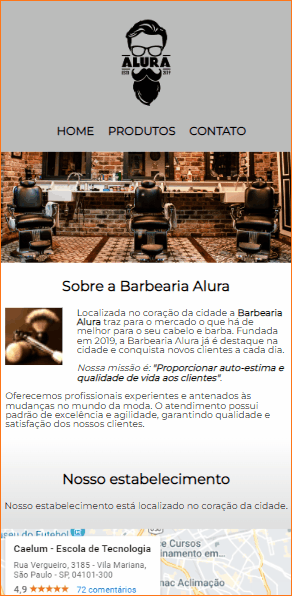

<h1 align="center">
  
</h1>

Neste projeto foi desenvolvido uma página para web de uma barbearia fictícia proposta pelo curso de HTML e CSS da formação Frontend da escola Alura.

 [👀 Visualize o projeto clicando aqui](https://revertemayene.github.io/site-barbearia-alura/)

 

 

## 🖥️ Prévia para Desktop

 
<h1 align="center">

  

 
</h1>

## 📱 Prévia para Mobile

 
<h1 align="center">

  

 
</h1>

## 🔥 Meus desafios

Meu maior desafio neste projeto foi tentar não usar muito o flexbox, pois todo o conteúdo era para práticar com técnicas anteriores.

  

## 🚀 Tecnologias utilizadas

✔️ HTML5

✔️ CSS3

  

Feito com o ❤️ por Mayene Reverte [Meu linkedIn](https://www.linkedin.com/in/mayenereverte/)

Criado em maio/2022

